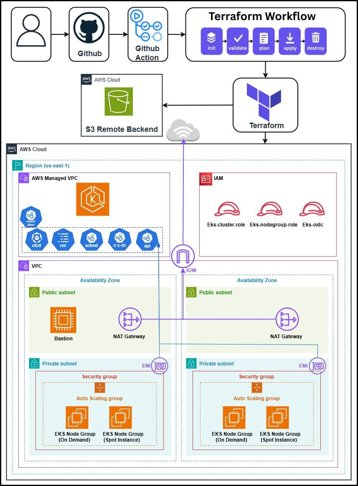

# Análise de Arquitetura - EKS com GitHub Actions

## Visão Geral

Este documento contém a análise detalhada da arquitetura do projeto EKS-Terraform-GitHub-Actions.

## Diagrama de Arquitetura



## Componentes da Arquitetura

### 1. Camada de Rede (VPC)

#### VPC Principal
- **CIDR Block**: Configurável via variável
- **DNS Hostname**: Habilitado
- **DNS Support**: Habilitado

#### Subnets Públicas
- **Quantidade**: 3 (uma por AZ)
- **AZs**: us-east-1a, us-east-1b, us-east-1c
- **Características**:
  - Auto-assign public IP: Sim
  - Route para Internet Gateway
  - Tags Kubernetes: `kubernetes.io/role/elb=1`

#### Subnets Privadas
- **Quantidade**: 3 (uma por AZ)
- **AZs**: us-east-1a, us-east-1b, us-east-1c
- **Características**:
  - Auto-assign public IP: Não
  - Route para NAT Gateway
  - Tags Kubernetes: `kubernetes.io/role/internal-elb=1`

#### Internet Gateway
- **Função**: Permitir acesso à internet para subnets públicas
- **Attachment**: VPC principal

#### NAT Gateway
- **Quantidade**: 1 (single NAT para reduzir custos)
- **Localização**: Subnet pública da primeira AZ
- **Elastic IP**: Alocado dinamicamente
- **Função**: Permitir acesso à internet para subnets privadas

#### Route Tables
- **Public Route Table**: 
  - Route 0.0.0.0/0 → Internet Gateway
  - Associada às 3 subnets públicas
- **Private Route Table**:
  - Route 0.0.0.0/0 → NAT Gateway
  - Associada às 3 subnets privadas

### 2. Segurança

#### Security Group - EKS Cluster
- **Ingress**:
  - Porta 443 (HTTPS)
  - Source: 0.0.0.0/0 (⚠️ Deveria ser mais restritivo)
- **Egress**:
  - All traffic
  - Destination: 0.0.0.0/0

**Nota**: O código contém comentário indicando que o ingress deveria ser mais específico.

### 3. Cluster EKS

#### Configuração do Cluster
- **Nome**: Configurável via variável
- **Versão**: Configurável (ex: 1.28)
- **Role ARN**: IAM role específica para o cluster
- **VPC Config**:
  - Subnets: 3 subnets privadas
  - Endpoint Private Access: Configurável
  - Endpoint Public Access: Configurável
  - Security Groups: EKS cluster SG

#### Access Config
- **Authentication Mode**: CONFIG_MAP
- **Bootstrap Creator Admin**: true

#### OIDC Provider
- **Client ID**: sts.amazonaws.com
- **Thumbprint**: Obtido via data source TLS certificate
- **URL**: URL do cluster EKS
- **Função**: Permitir que pods assumam IAM roles

#### EKS Add-ons
Configuráveis via variável, exemplos:
- vpc-cni
- kube-proxy
- coredns
- aws-ebs-csi-driver

### 4. Node Groups

#### On-Demand Node Group
- **Nome**: `<cluster-name>-on-demand-nodes`
- **Capacity Type**: ON_DEMAND
- **Instance Types**: Configurável via variável
- **Scaling Config**:
  - Desired: Configurável
  - Min: Configurável
  - Max: Configurável
- **Subnets**: 3 subnets privadas
- **Labels**: `type=ondemand`
- **Update Config**: max_unavailable=1

#### Spot Node Group
- **Nome**: `<cluster-name>-spot-nodes`
- **Capacity Type**: SPOT
- **Instance Types**: Configurável via variável
- **Scaling Config**:
  - Desired: Configurável
  - Min: Configurável
  - Max: Configurável
- **Subnets**: 3 subnets privadas
- **Labels**: `type=spot`, `lifecycle=spot`
- **Disk Size**: 50 GB
- **Update Config**: max_unavailable=1

### 5. IAM

#### EKS Cluster Role
- **Managed Policies**:
  - AmazonEKSClusterPolicy
  - AmazonEKSVPCResourceController
- **Trust Relationship**: eks.amazonaws.com

#### EKS Node Group Role
- **Managed Policies**:
  - AmazonEKSWorkerNodePolicy
  - AmazonEKS_CNI_Policy
  - AmazonEC2ContainerRegistryReadOnly
  - AmazonSSMManagedInstanceCore
- **Trust Relationship**: ec2.amazonaws.com

### 6. Backend (State Management)

#### S3 Bucket
- **Função**: Armazenar Terraform state
- **Versioning**: Habilitado (recomendado)
- **Encryption**: Recomendado (não visível no código)

#### DynamoDB Table
- **Função**: State locking
- **Hash Key**: LockID
- **Billing Mode**: PAY_PER_REQUEST ou PROVISIONED

### 7. CI/CD (GitHub Actions)

#### Workflow Triggers
- **workflow_dispatch**: Manual trigger
- **Inputs**:
  - tfvars_file: Caminho para arquivo de variáveis
  - action: plan, apply ou destroy

#### Jobs
1. **Checkout**: Baixar código do repositório
2. **Setup Terraform**: Instalar Terraform 1.10.3
3. **Cache Terraform**: Cache de plugins e .terraform
4. **Terraform Init**: Inicializar backend e providers
5. **Terraform Format Check**: Validar formatação
6. **Terraform Validate**: Validar sintaxe
7. **Terraform Plan/Apply/Destroy**: Executar ação selecionada

#### Secrets
- AWS_ACCESS_KEY_ID
- AWS_SECRET_ACCESS_KEY

## Fluxo de Dados

### Tráfego de Entrada (Ingress)
```
Internet → Internet Gateway → Public Subnet → Load Balancer → Private Subnet → EKS Pods
```

### Tráfego de Saída (Egress)
```
EKS Pods → Private Subnet → NAT Gateway → Internet Gateway → Internet
```

### Acesso ao Control Plane
```
User/CI → Public Endpoint (443) → EKS Control Plane
```

## Análise de Custos

### Custos Mensais Estimados (us-east-1)

| Recurso | Quantidade | Custo Unitário | Custo Total |
|---------|------------|----------------|-------------|
| EKS Cluster | 1 | $0.10/hora | ~$73/mês |
| NAT Gateway | 1 | $0.045/hora | ~$32/mês |
| NAT Data Processing | - | $0.045/GB | Variável |
| EC2 On-Demand (t3.medium) | 2 | $0.0416/hora | ~$60/mês |
| EC2 Spot (t3.medium) | 2 | ~$0.0125/hora | ~$18/mês |
| EBS Volumes (50GB) | 4 | $0.10/GB/mês | ~$20/mês |
| Data Transfer | - | Variável | ~$10/mês |
| **TOTAL** | - | - | **~$213/mês** |

**Nota**: Custos reais podem variar significativamente baseado em:
- Tipos de instância escolhidos
- Número de nodes
- Tráfego de rede
- Armazenamento adicional

### Otimizações de Custo

1. **Usar Spot Instances**: Até 90% de economia vs On-Demand
2. **Single NAT Gateway**: Reduz custos mas elimina redundância
3. **Right-sizing**: Escolher instance types adequados
4. **Auto Scaling**: Escalar nodes baseado em demanda
5. **Reserved Instances**: Para workloads previsíveis (não aplicável a EKS control plane)

## Pontos Fortes da Arquitetura

1. ✅ **Alta Disponibilidade**: 3 AZs
2. ✅ **Separação de Concerns**: Subnets públicas e privadas
3. ✅ **Segurança**: Nodes em subnets privadas
4. ✅ **Escalabilidade**: Auto Scaling Groups
5. ✅ **Cost Optimization**: Uso de Spot instances
6. ✅ **Modularidade**: Código bem organizado
7. ✅ **Automação**: CI/CD completo

## Pontos de Melhoria

1. ⚠️ **Single NAT Gateway**: Ponto único de falha
2. ⚠️ **Security Group Aberto**: Ingress 0.0.0.0/0 na porta 443
3. ⚠️ **Falta de Network Policies**: Sem controle de tráfego entre pods
4. ⚠️ **Falta de WAF**: Sem proteção contra ataques web
5. ⚠️ **Falta de Monitoring**: Sem CloudWatch Container Insights
6. ⚠️ **Falta de Logging**: Sem logging centralizado
7. ⚠️ **Módulo Monolítico**: VPC, IAM e EKS juntos

## Recomendações de Melhorias

### Curto Prazo
1. Restringir Security Group para IPs específicos
2. Adicionar tfsec e checkov ao workflow
3. Implementar múltiplos ambientes (dev/staging/prod)
4. Adicionar cost estimation (Infracost)

### Médio Prazo
1. Separar módulos (VPC, IAM, EKS)
2. Adicionar NAT Gateway por AZ para HA
3. Implementar CloudWatch Container Insights
4. Configurar logging centralizado (CloudWatch Logs)
5. Adicionar Network Policies

### Longo Prazo
1. Implementar WAF com CloudFront
2. Adicionar Prometheus + Grafana
3. Implementar GitOps com ArgoCD
4. Adicionar service mesh (Istio/Linkerd)
5. Implementar disaster recovery

## Conclusão

A arquitetura é sólida e production-ready, com boas práticas de segurança e escalabilidade. As principais melhorias necessárias são:
- Maior granularidade nos módulos
- Melhorias de segurança (SG, Network Policies)
- Observabilidade (monitoring e logging)
- Redundância (múltiplos NAT Gateways)

---

**Data da Análise**: Outubro 2025
**Versão do Projeto**: Original (KUNAL-MAURYA1470)
